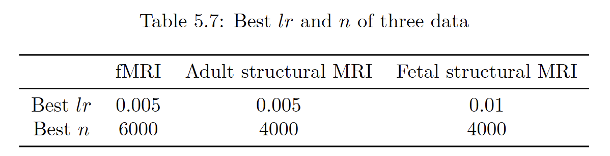

# Implicit-Function-Learning-on-fMRI-Motion-Correction
The code and data for Implicit Function Learning on fMRI Motion Correction will be uploaded here.

   

Figure 1. SVoRT: an iterative Transformer for slice-to-volume registration. (a) The k-th iteration of SVoRT. (b) The detailed network architecture of the SVT module.

