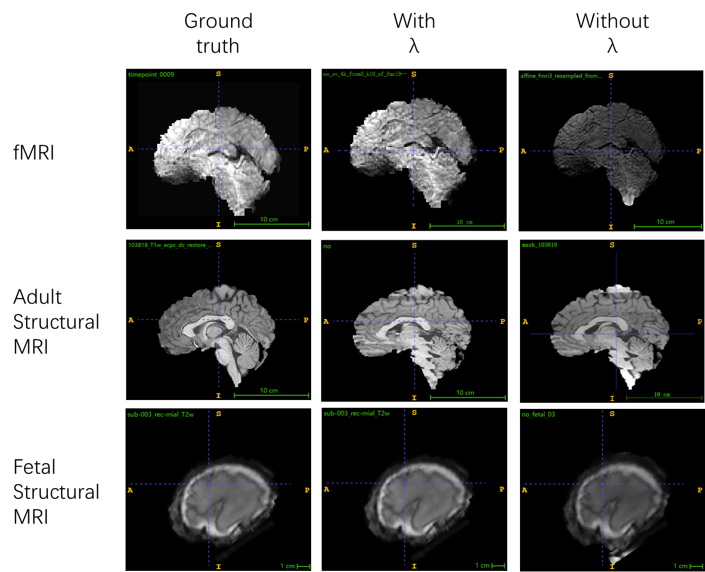
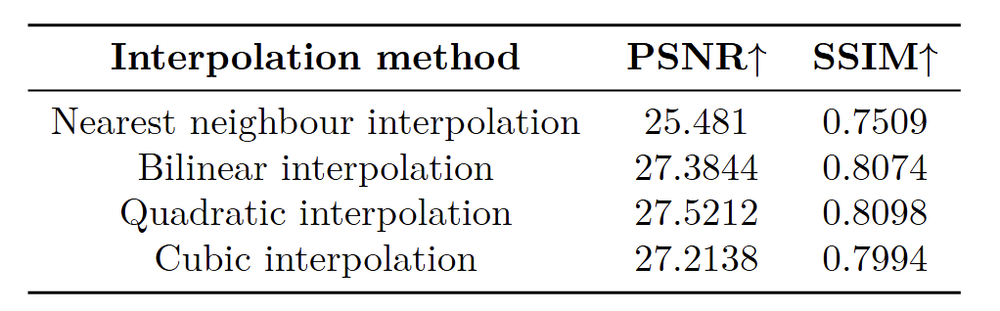
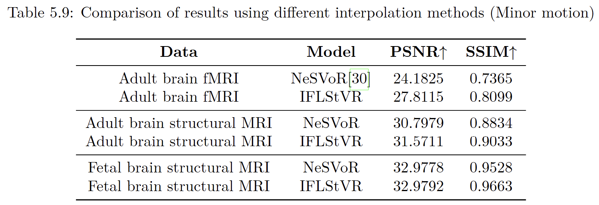
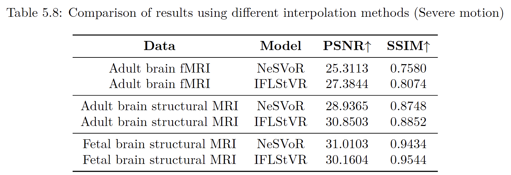
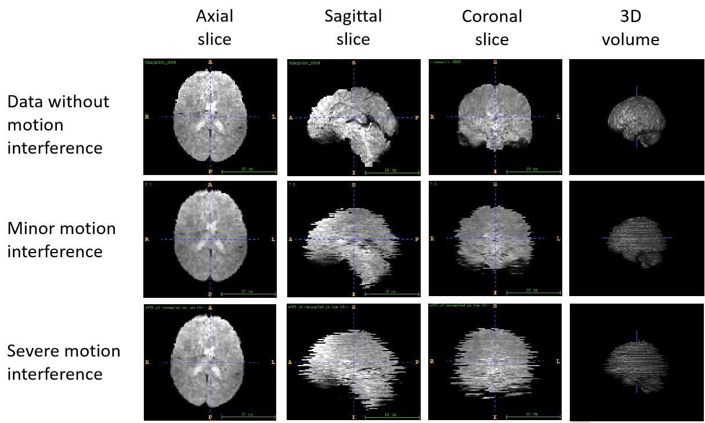
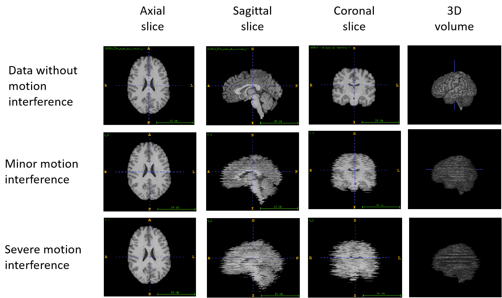
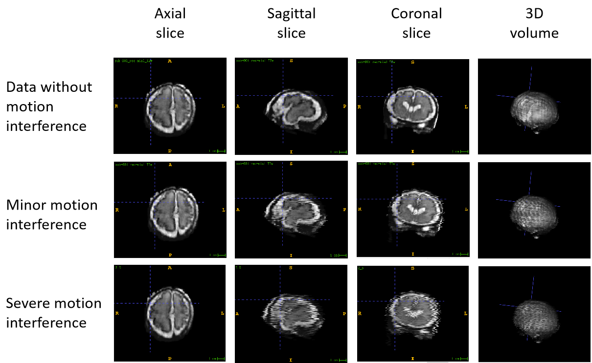

# Implicit-Function-Learning-on-fMRI-Motion-Correction
The code and data for Implicit Function Learning on fMRI Motion Correction will be uploaded here.

   

Figure 1. SVoRT.

   

Figure 1. SVoRT.

   

Figure 1. SVoRT.

   

Figure 1. SVoRT.

   

Figure 1. SVoRT.

   

Figure 1. SVoRT.

   

Figure 1. SVoRT.

   

Figure 1. SVoRT.

